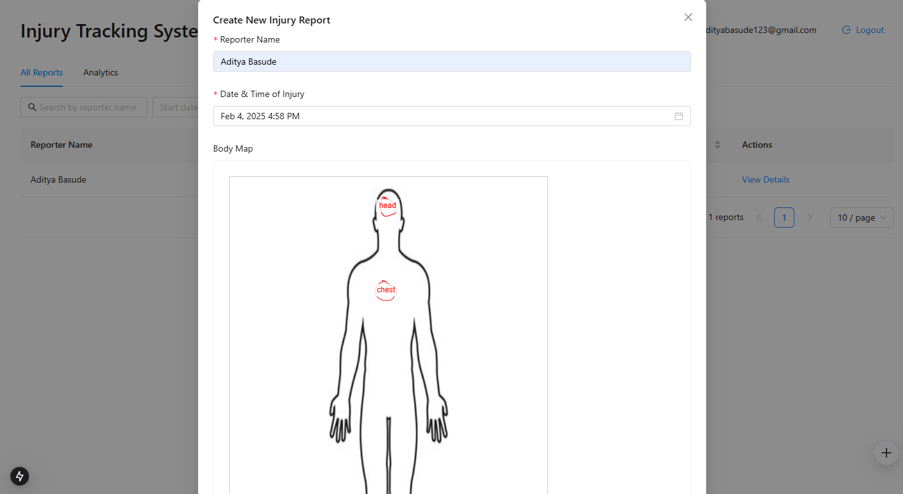
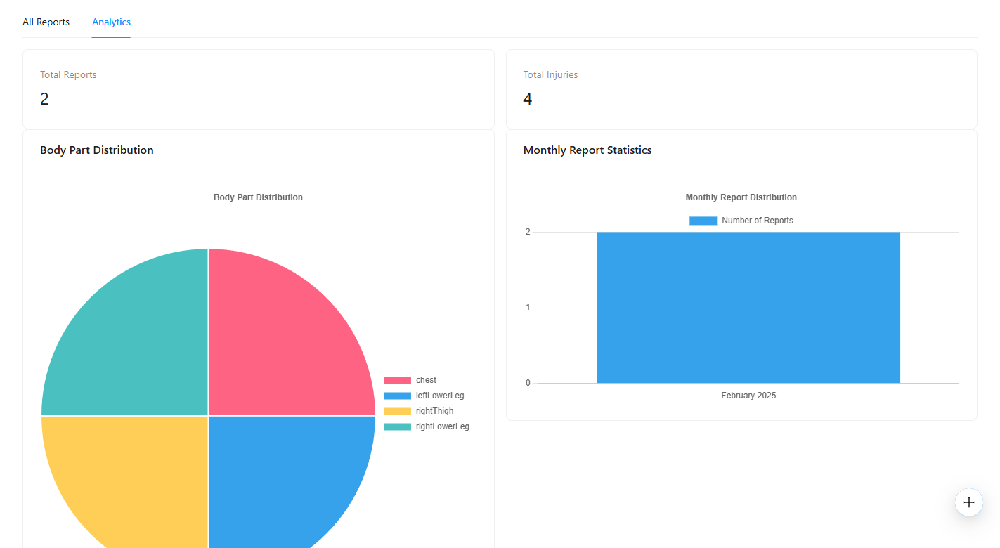
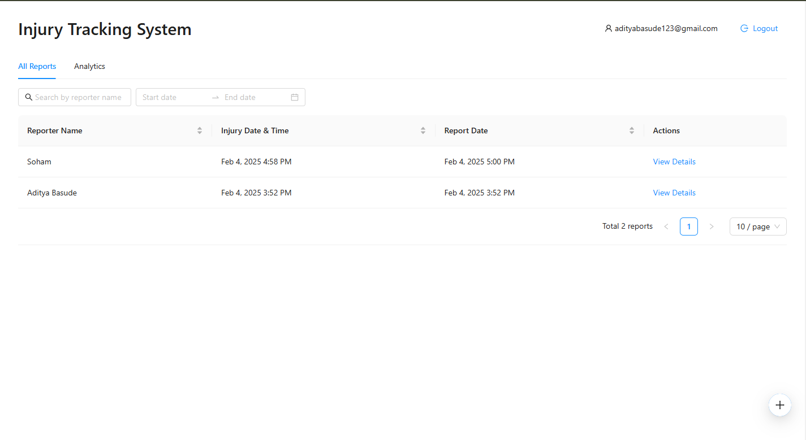

# Injury Tracking System

A modern web application for tracking and analyzing workplace injuries with interactive body mapping and analytics.

## Overview

The Injury Tracking System allows organizations to:
- Record injuries using an interactive body map
- Track injury locations and details
- Generate analytics and visualizations
- Manage injury reports with CRUD operations

## Tech Stack

- **Frontend**:
  - Next.js 15
  - React
  - Ant Design (UI Components)
  - Chart.js / react-chartjs-2 (Analytics Visualization)
  - Apollo Client (GraphQL)
  - Auth0 (Authentication)

- **Backend**:
  - GraphQL API
  - Prisma (ORM)

- **Database**:
  - PostgreSQL

## Key Features

### Interactive Body Mapping

- Visual injury location marking
- Multiple injury points tracking
- Body part categorization

### Analytics Dashboard

- Injury distribution charts
- Monthly report trends
- Statistical summaries

### Report Management

- Searchable reports list
- Detailed injury tracking
- Status management

